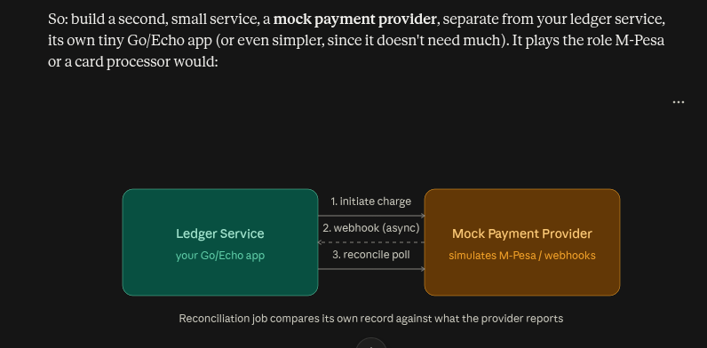
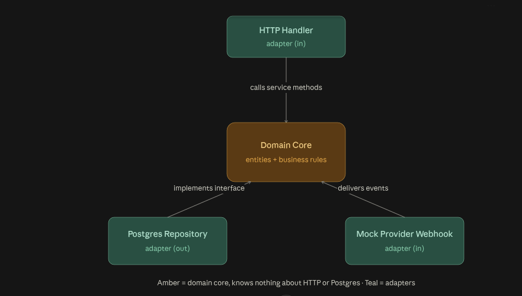

- This will be checking more on **correctness** and **trust** in the data itself.
- **Ledger** : system of record for money moving around.
- Every deposit, withdrawal, transfer, fee, refund, it has to be recorded in a way thats provably correct, replayable, and reconciliable against outside sources, forever.

# Core Concepts

**Double entry book-keeping**

- Every single transaction is recorded as 2 entries, a debit and a credit, in different accounts, and they must always sum to 0.
- Alice sends Bob ksh.10
  - Debit Alice's account by ksh.10
  - Credit Bob's account by ksh.10
  - Sum of the two entries = 0

- This is the core of the ledger, and it isn't a design choice you can skip, its what makes a ledger provably correct, at any moment you can sum every entry in the system, and it must equal 0, if it doesn't, something is broken, and you know immediately.

**Idempotency**

- Payment systems live in a world of retries, network fails, webhook gets re-delivered, clients time out and resend. If your API isn't idempotent, the same "charge $50 request arriving twice charges $100".
- The fix is an idempotency key, a unique ID the caller attaches to a request, that your system checks before processing, "i have seen this exact key before? If so, return the original result, don't do it again."

**Event sourcing**

- Instead of a table that just holds "current_balance", you store an append only immutable log of every event that ever happened, "deposited $100", "withdrew $50". The current balance is derived by replaying that log, not stored as a mutable number you update in place.
- This is important for **auditability** and **replayability**, you can always go back and see exactly what happened, and if you need to rebuild the current state, you can do so by replaying the events.

**Reconciliation**

- Internal ledger says one thing; the external payment provider has its own independent record of the same transactions. Reconciliation is the process of automatically comparing the two, flagging mismatches, and having a defined process for resolving them.
- This is where "pending" vs "settled" states comes in, a transaction often isn't instantly final, it moves through states over time, and the system needs to handle this gracefully rather than assuming everything is synchronous.

- data must remain correct overtime, a system must remain consistent not just under concurrent access, but across replays, retries, crashes, and comparisons against an external source of truth it doesn't control.
- Incorrectness should be impossible or at minimum, always detectable, and the system should be able to recover from it, either automatically or with human intervention.

**Build Phases**

1. Schema design

- Design the double entry schema itself; accounts, entries, the balance-sums-to-zero invariant, DECIMAL for money. This phase entirely designs the data model, no API yet.

2. Core ledger ops

- Build the actual deposit, withdraw, transfer functions, each one wrapped in a real DB transaction that writes both entries atomically, both succeed or both rolled back, nothing in between.

3. Idempotency

- Add idempotency keys to the API, then fire the same request twice, prove it doesn't double apply.

4. Event sourcing

- restructure so the event log is the actual source of truth, and build a replay function that rebuilds account balances from the log alone, then prove it matches the live balances.

5. Reconciliation

- Simulate an external system (a mock webhook feed representing "what a payment provider says happened"), then build the job that compares it against the internal ledger and surface discrepancies.

6. Pending/settled state machine

- Introduce asynchronous settlement, a transaction starts pending, later transitions to settled or failed, and your system has to handle reads and reconciliation correctly across this window.

7. Observability

- Logging and metrics.

# Clean Architecture in a nutshell but Domain Driven Design heavy
1. **Layered Architecture**
- Whatever I use in the Go projects. Everything HTTP related lives in controllers/ everything DB-related lives in database/ regardless of which business feature it belongs to.

2. **Repository Pattern**

3. **Command Query Responsibility Segregation (CQRS)**
- separate models for writing vs reading data.

4. **Domain Driven Design (DDD)**
- About where the complexity actually lives. 
- The hard part about the software isn't the framework, DB or HTTP layer, those are solved problems, its correctly modelling the business rules themselves.
- So DDD organizes code around business capabilities (ledger, reconciliation) rather than technical layers (controllers, models), and keeping business logic completely ignorant of HTTP, Postgres, or any other technical detail.
- The DB doesn't know its a ledger, the ledger domain shouldn't know its Postgres.

/cmd/server/main.go

/internal/
  /ledger/
    entity.go        # Account, Entry, Transaction — the actual domain model
    repository.go    # interface LedgerRepository { Save(...), GetBalance(...) }
    service.go        # use cases: Deposit, Withdraw, Transfer

  /reconciliation/
    entity.go
    service.go        # compares internal ledger vs provider statement

  /postgres/
    ledger_repository.go   # implements ledger.LedgerRepository

  /http/
    ledger_handler.go      # translates HTTP <-> ledger.Service calls
    router.go

/migrations/